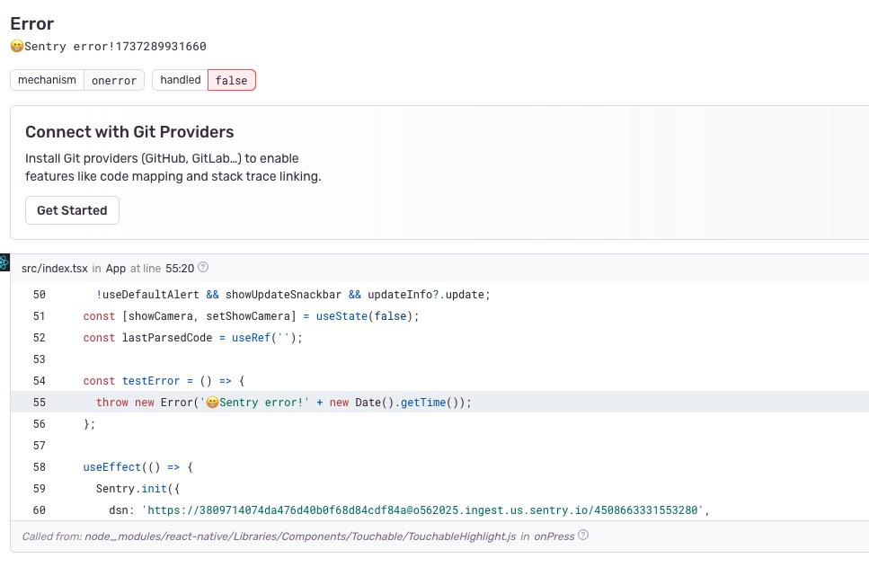

### 1.测试同时集成 pushy 和 sentry 手动触发报错

测试结果：sentry 平台收到报错，同时可以查看错误详细堆栈信息


### 2.测试热更新后手动触发报错

测试结果：sentry 平台收到报错，同时可以查看错误详细堆栈信息




### 3.如果同时集成Sentry和Pushy并且热更成功后触发报错在sentry平台看不到详细堆栈信息

解决方案：请更新react-native-update、react-native-cli到最新版本，同时在xcode添加一个脚本配置：
```sh
"../node_modules/react-native-update/scripts/sentry.sh"
```


### 4. iOS上传sourcemap到sentry平台流程说明
Xcode在每次编译成功后都会自动上传当前代码对应的的sourcemap到sentry平台，当后续有js源码变动热更需求后需要再次执行Xcode Build操作，此时会自动上传新的sourcemap到sentry平台，同时会在项目根目录.pushy生成对应的资源文件，然后手动执行pushy bundleAfterXcodeBuild命令进行文件压缩打包成ppk，最后可以选择上传和绑定原生版本，至此成功发布热更新到pushy。

### 5. Android端sentry配置需要在android/app/build.gradle中添加如下配置
```sh
apply from: new File(["node", "--print", "require.resolve('react-native-update/package.json')"].execute().text.trim(), "../scripts/sentry.gradle")
```


### 6. Anddroid上传sourcemap到sentry平台流程说明
AndroidStudio在每次编译成功后都会自动上传当前代码对应的的sourcemap到sentry平台，当后续有js源码变动热更需求后需要再次执行AS Build操作，此时会自动上传新的sourcemap到sentry平台，同时会在项目根目录.pushy生成对应的资源文件，然后手动执行pushy bundleAfterAndroidStudioBuild命令进行文件压缩打包成ppk，最后可以选择上传和绑定原生版本，至此成功发布热更新到pushy。